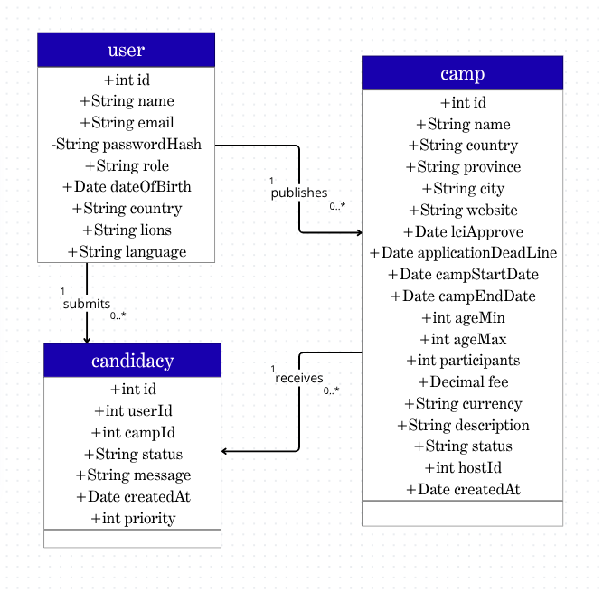

# CulturalExchange

A REST API platform for managing youth camp exchange opportunities.

## About

CulturalExchange was born from a real problem. In youth exchange programs, camp opportunities — dates, host countries, age requirements, fees, contacts — are often shared as PDF files scattered across group chats. Finding a camp that fits (by country, date, or language) means digging through documents by hand, and applying is just as informal.

This project replaces that chaos with a structured system: host organizers publish exchange opportunities, and members can search and apply to them in an organized way. It started as a learning project to build a strong backend foundation from scratch — data modeling, a relational database, and a REST API — while solving a problem I've experienced firsthand through volunteer work.

## Tech Stack

- **Python**
- **FastAPI** — web framework for building the REST API
- **SQLModel** — ORM layer (SQLAlchemy + Pydantic) for models and schemas
- **SQLite** — database (chosen for simplicity during development; the ORM makes migrating to PostgreSQL straightforward)
- **bcrypt** — password hashing

## Data Model

The system is built around three core entities and their relationships:

- **User** — a member, host, or assistant. Publishes camps (as a host) and applies to them (as a member).
- **Camp** — an exchange opportunity, with location, dates, age range, fee, and a host.
- **Candidacy** — links a user to a camp they've applied to, with a priority and status.

A user can publish many camps (one-to-many), and the `Candidacy` table resolves the many-to-many relationship between users and camps: a user can apply to several camps, and a camp can receive several applicants.

Passwords are never stored in plain text — they are hashed with bcrypt, and the API never returns password data in its responses.



*Class diagram: the three core entities, their fields, and the relationships between them.*

## Getting Started

### Prerequisites

- Python 3.12+

### Installation

```bash
# Clone the repository
git clone https://github.com/YasmimAr/culturalexchange.git
cd culturalexchange

# Create and activate a virtual environment
python3 -m venv venv
source venv/bin/activate

# Install dependencies
pip install fastapi sqlmodel bcrypt
```

### Running

```bash
# Create the database tables
python -m database.database

# Start the development server
fastapi dev main/main.py
```

The API will be available at `http://127.0.0.1:8000`.

Interactive API documentation (Swagger UI) is auto-generated at `http://127.0.0.1:8000/docs`, where you can try out the endpoints directly in the browser.

## Business Rules

- A user can apply to a maximum of 3 camps, each with a distinct priority (1, 2, or 3).
- A user cannot apply to the same camp twice.
- Age does not block an application — the host makes the final selection decision.
- `participants` is informational only; the host manages capacity manually.
- A host cannot apply to their own camp.

## Roadmap

- [x] Data models for User, Camp, and Candidacy
- [x] Database setup and table creation
- [x] User creation endpoint with password hashing
- [x] Camp and Candidacy creation endpoints
- [x] Full CRUD endpoints for all entities
- [x] Authentication and login
- [ ] Enforce business rules in the application layer
- [ ] Frontend interface

## License

This is a personal learning project.