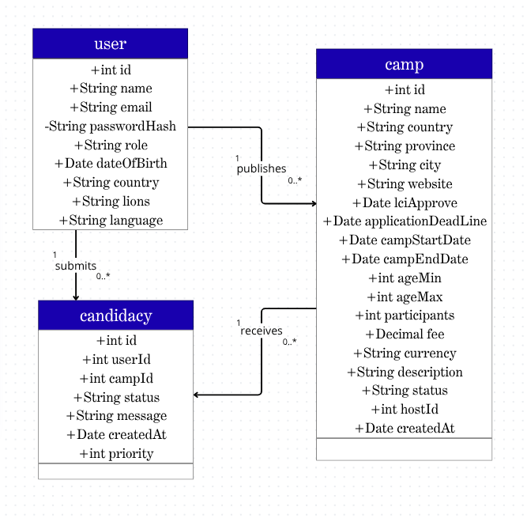

# CulturalExchange

A REST API platform for managing youth camp exchange opportunities.

## About

CulturalExchange was born from a real problem. In youth exchange programs, camp opportunities — dates, host countries, age requirements, fees, contacts — are often shared as PDF files scattered across group chats. Finding a camp that fits (by country, date, or language) means digging through documents by hand, and applying is just as informal.

This project replaces that chaos with a structured system: host organizers publish exchange opportunities, and members can search and apply to them in an organized way. It started as a learning project to build a strong backend foundation from scratch — data modeling, a relational database, and a REST API — while solving a problem I've experienced firsthand through volunteer work.

## Tech Stack

- **Python**
- **FastAPI** — web framework for building the REST API
- **SQLModel** — ORM layer (SQLAlchemy + Pydantic) for models and schemas
- **SQLite / PostgreSQL** — SQLite for local development, PostgreSQL in production (the ORM makes switching seamless)
- **bcrypt** — password hashing
- **PyJWT** — JSON Web Tokens for authentication

## Features
- Full CRUD for Users, Camps, and Candidacies
- JWT-based authentication with a login endpoint and protected routes
- Ownership authorization — users can only edit or delete their own resources
- Role-based access — only hosts can create camps
- Business rules enforced in the application layer (see below)
- Search filters for camps (by country, language, minimum start date, and age)
- Auto-generated interactive API documentation (Swagger UI)

## Data Model

The system is built around three core entities and their relationships:

- **User** — a member, host, or assistant. Publishes camps (as a host) and applies to them (as a member).
- **Camp** — an exchange opportunity, with location, dates, age range, fee, language, and a host.
- **Candidacy** — links a user to a camp they've applied to, with a priority and status.

A user can publish many camps (one-to-many), and the `Candidacy` table resolves the many-to-many relationship between users and camps: a user can apply to several camps, and a camp can receive several applicants.

Passwords are never stored in plain text — they are hashed with bcrypt, and the API never returns password data in its responses.



*Class diagram: the three core entities, their fields, and the relationships between them.*

## Authentication

Authentication uses OAuth2 with JWT tokens:

- `POST /token` — log in with email and password, receive an access token
- Protected routes require the token in the `Authorization` header
- `GET /me` — returns the currently authenticated user

Ownership and role checks run before any create, update, or delete: the host is set from the authenticated user (not the request body), and users can only modify what belongs to them.

## Business Rules

- Only users with the `host` role can create camps.
- Only the host who created a camp can edit or delete it.
- Only the owner of a candidacy can edit or cancel it; only the camp's host can change a candidacy's status (accept/reject).
- A host cannot apply to their own camp.
- A user cannot apply to the same camp twice.
- A user can apply to a maximum of 3 camps, each with a distinct priority (1, 2, or 3).
- `participants` is informational only — the host manages capacity manually.

## Search Filters

The camp listing endpoint (`GET /camp/`) accepts optional query parameters:

- `country` — camps in a specific country
- `language` — camps offered in a given language
- `start_after` — camps starting on or after a given date
- `age` — camps whose age range includes the given age

Filters can be combined; omitting them returns all camps.

## Getting Started

### Prerequisites

- Python 3.12+

### Installation

```bash
# Clone the repository
git clone https://github.com/YasmimAr/culturalexchange.git
cd culturalexchange

# Create and activate a virtual environment
python3 -m venv venv
source venv/bin/activate

# Install dependencies
pip install -r requirements.txt
```

Create a `.env` file in the project root with your secret key:

```
SECRET_KEY=your_secret_key_here
```

(You can generate one with `openssl rand -hex 32`.)

### Running

```bash
# Create the database tables
python -m database.database

# Start the development server
fastapi dev main/main.py
```

The API will be available at `http://127.0.0.1:8000`.

Interactive API documentation (Swagger UI) is auto-generated at `http://127.0.0.1:8000/docs`, where you can try out the endpoints directly in the browser.

## Roadmap

- [x] Data models for User, Camp, and Candidacy
- [x] Database setup and table creation
- [x] Password hashing (bcrypt)
- [x] Full CRUD endpoints for all entities
- [x] JWT authentication and login
- [x] Ownership and role-based authorization
- [x] Business rules in the application layer
- [x] Search filters for camps
- [ ] Deploy to production (PostgreSQL)
- [ ] Frontend interface (React)
- [ ] Assistant assignment (many assistants per camp, can edit assigned camps)

## License

This is a personal learning project.